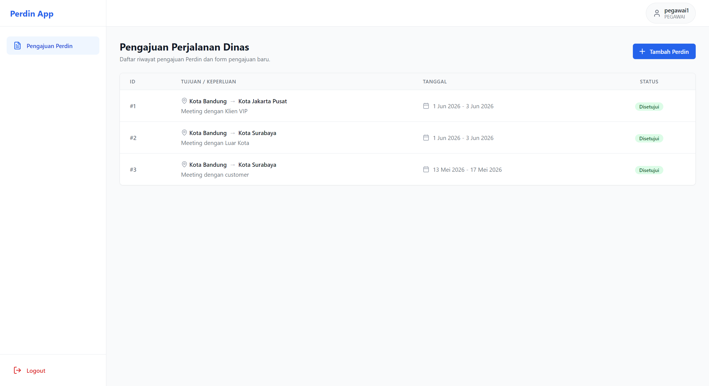
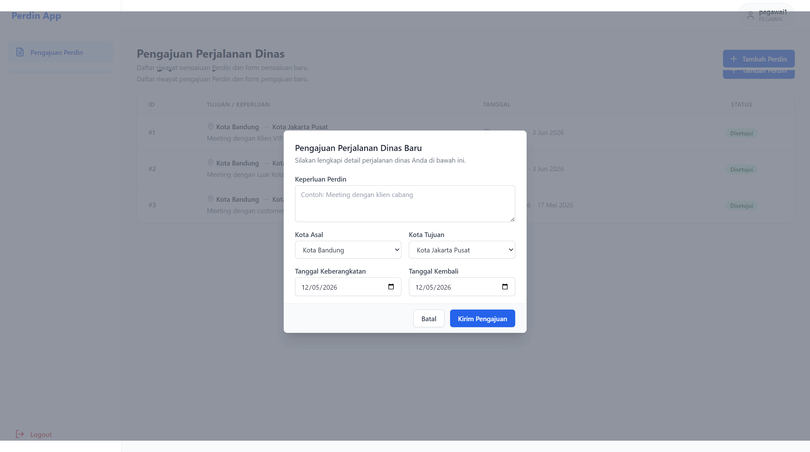
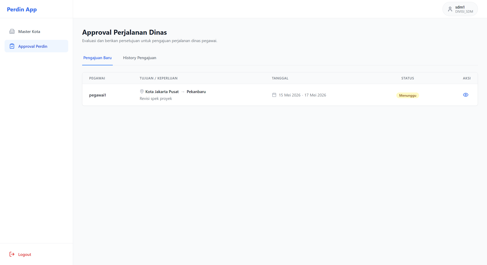
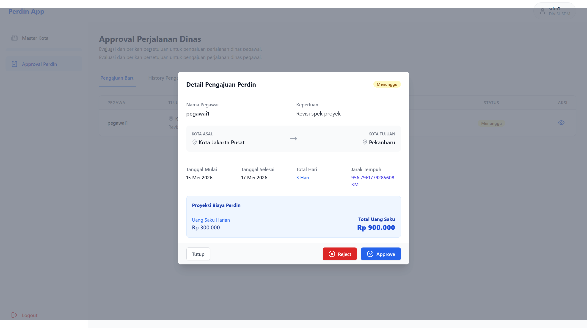
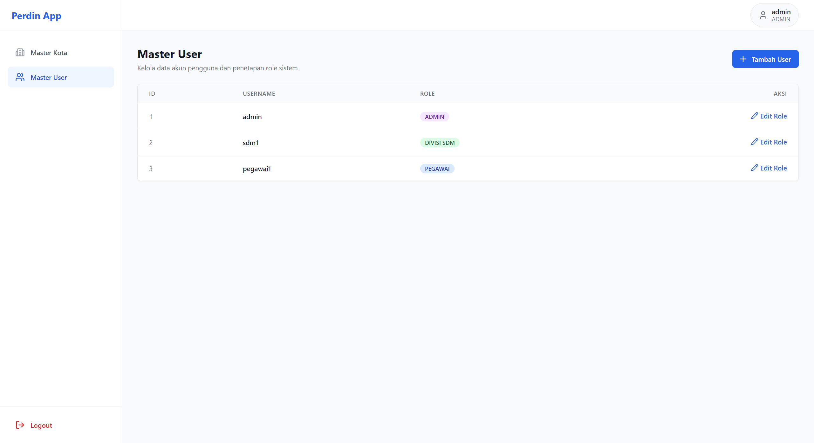
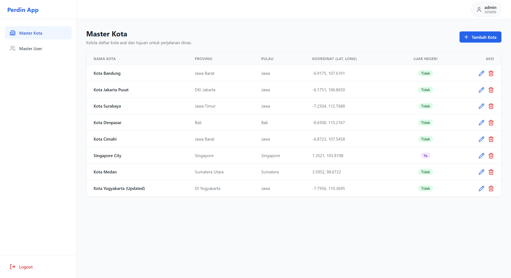

# Perdin - Aplikasi Perjalanan Dinas (Fullstack Golang & React)


Aplikasi **Perjalanan Dinas (Perdin)** adalah sistem manajemen terpadu yang dirancang untuk mengelola pengajuan, persetujuan, dan perhitungan biaya perjalanan dinas pegawai secara otomatis berdasarkan jarak (latitude/longitude) dan klasifikasi wilayah. Aplikasi ini dibangun dengan arsitektur Fullstack menggunakan **Golang (Gin Framework)** di sisi backend dan **React + Tailwind CSS** di sisi frontend.

## 🚀 Fitur Utama

- **Role-Based Access Control (RBAC) dengan JWT**:
  - `ADMIN`: Akses penuh ke Master User dan Master Kota.
  - `DIVISI_SDM`: Memproses (Approve/Reject) pengajuan perdin dari seluruh pegawai, serta mengelola Master Kota.
  - `PEGAWAI`: Mengajukan perdin baru dan memantau riwayat pengajuannya sendiri.
- **Kalkulasi Biaya Otomatis (Haversine Formula)**:
  - Uang saku dihitung secara dinamis oleh backend berdasarkan jarak antara kota asal dan tujuan menggunakan koordinat (Latitude & Longitude).
  - Klasifikasi: Dalam kota (<60km), Dalam Provinsi, Beda Provinsi (Satu Pulau / Beda Pulau), dan Luar Negeri (USD).
- **Manajemen Master Data**: Pengelolaan data pengguna dan daftar kota secara komprehensif.
- **Approval Workflow**: SDM dapat mempreview detail pengajuan (lengkap dengan proyeksi biaya total) sebelum memberikan persetujuan.

## 🛠️ Teknologi yang Digunakan

### Frontend
- **React.js 19** (via Vite)
- **TypeScript** untuk _type-safety_
- **Tailwind CSS v3** untuk styling UI yang responsif dan minimalis
- **React Router DOM v7** untuk navigasi dinamis berbasis _Role_
- **Axios** terintegrasi dengan JWT Interceptors
- **Lucide React** untuk koleksi ikon modern

### Backend
- **Golang**
- **Gin Web Framework** untuk routing HTTP dan pembuatan REST API yang cepat
- **GORM** untuk ORM dan Automigrasi Database
- **PostgreSQL** sebagai Relational Database Management System (RDBMS)
- **Golang-JWT & Bcrypt** untuk Autentikasi Stateless dan Hashing Password

---

## 📸 Showcase (Galeri UI)

### 1. Autentikasi

*Halaman Login minimalis dengan fitur Reset Password terintegrasi.*

### 2. Portal Pegawai (Pengajuan Perdin)

*Riwayat pengajuan Perdin milik pegawai dengan badge status yang interaktif.*


*Form pengajuan Perdin dengan pemilihan kota dinamis dan validasi tanggal.*

### 3. Portal Divisi SDM (Approval)

*Daftar pengajuan baru yang menunggu tindakan persetujuan.*


*Modal Approval yang menampilkan rincian jarak tempuh, durasi, dan proyeksi total uang saku.*

### 4. Portal Admin (Master Data)

*Halaman pengelolaan akun pengguna beserta Role-nya.*


*Halaman Master Kota beserta pengelolaan titik koordinat untuk dasar kalkulasi jarak.*

---

## 💻 Cara Menjalankan Secara Lokal

1. **Clone Repository**
```bash
   git clone [https://github.com/rajuputra/perdin-go-react.git](https://github.com/rajuputra/perdin-go-react.git)
   cd perdin-go-react
```
2. **Jalankan Backend (Spring Boot)**
   Pastikan Anda sudah menginstal PostgreSQL dan membuat database kosong bernama perdin_db. Kemudian, buat file .env di root direktori dengan format berikut:
   ```bash
   DB_USER=postgres
   DB_PASSWORD=password_postgres_anda
   DB_HOST=127.0.0.1
   DB_PORT=5432
   DB_NAME=perdin_db
   JWT_SECRET=rahasia_jwt_anda
   SERVER_PORT=8080
   ```
   Setelah itu, jalankan perintah:
   ```bash
   go mod tidy
   go run main.go
   ```
   GORM akan melakukan automigrasi tabel secara otomatis. Backend akan berjalan di port 8080.

4. **Jalankan Frontend (React)**
   Buka jendela terminal baru, masuk ke folder `perdin` (direktori frontend).
   ```bash
   cd perdin
   npm install
   npm run dev
   ```
   Aplikasi frontend dapat diakses melalui browser di alamat `http://localhost:3000` atau `http://localhost:5173`.
